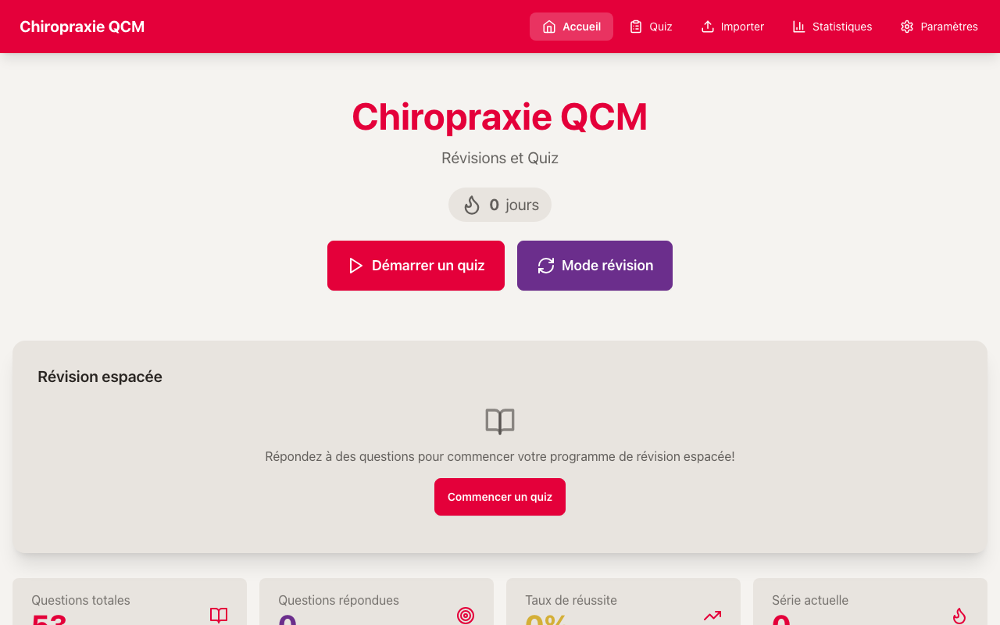
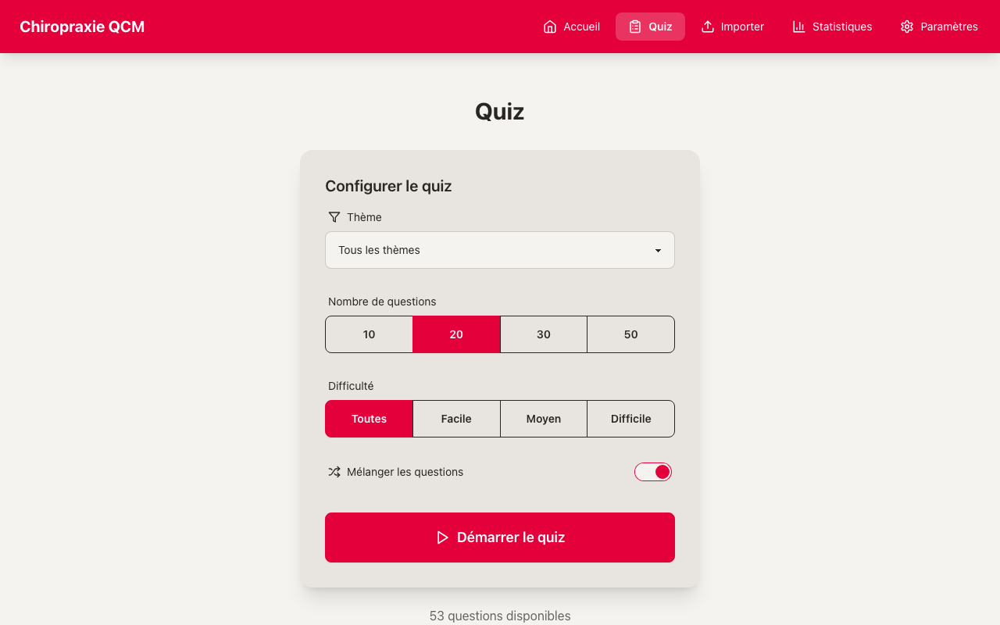
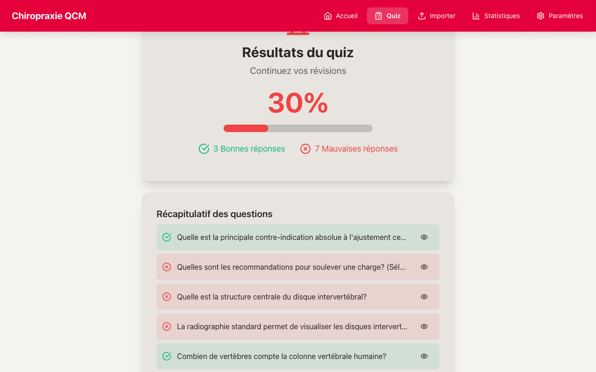
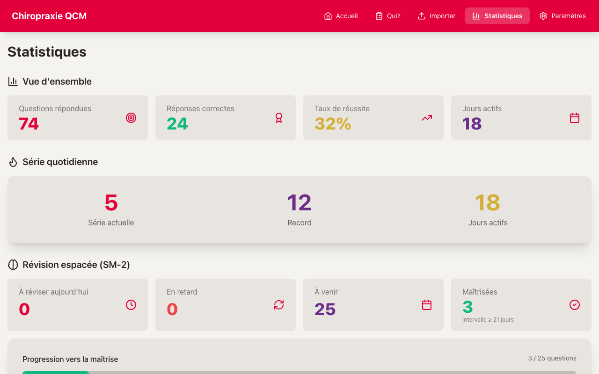
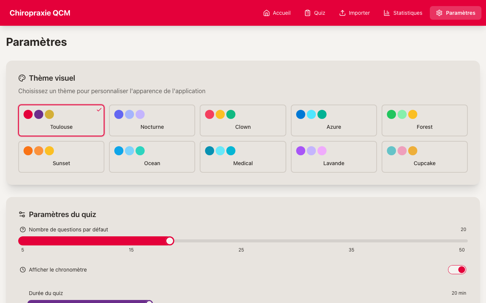
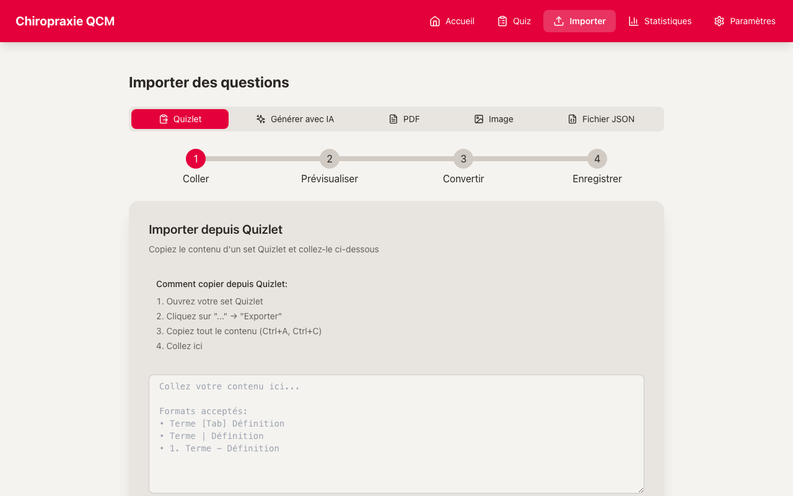
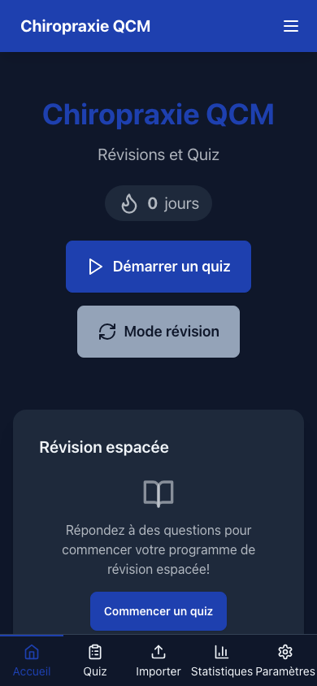

# 🦴 Chiropraxie QCM V2

> Application PWA de quiz pour la révision en chiropraxie — offline-first, avec IA locale et répétition espacée.

[](https://github.com/dmicheneau/chiropraxie-qcm-v2/actions)
[](https://codecov.io/gh/dmicheneau/chiropraxie-qcm-v2)
[](LICENSE)
[](#)
[](#)

---

## 📸 Captures d'écran

<p align="center">
  
</p>
<p align="center"><em>Page d'accueil — tableau de bord avec statistiques et streaks</em></p>

<details>
<summary>🖼️ Voir toutes les captures</summary>

<br>

|                 Quiz                 |                 Résultats                  |
| :----------------------------------: | :----------------------------------------: |
|    |  |
| _Configuration et lancement de quiz_ |    _Résultats détaillés après un quiz_     |

|                Statistiques                 |                 Thèmes                 |
| :-----------------------------------------: | :------------------------------------: |
|  |  |
| _Dashboard avec graphiques et progression_  |  _10 thèmes visuels personnalisables_  |

|                  Import                  |                Mobile (Dark mode)                |
| :--------------------------------------: | :----------------------------------------------: |
|    |  |
| _Import depuis Quizlet, PDF, images, IA_ |          _Vue mobile — thème Nocturne_           |

</details>

---

## ✨ Fonctionnalités

- **Quiz multi-types** — QCM classique, Vrai/Faux, réponses multiples
- **11 thèmes de chiropraxie** — Anatomie, Neurologie, Techniques, Pathologie, Biomécanique, Sécurité, Examen clinique, Imagerie, Pharmacologie, Pédiatrie, Ergonomie
- **Répétition espacée** — Algorithme SM-2 pour optimiser la mémorisation à long terme
- **IA locale (Ollama)** — Génération de questions par modèle local (mistral:7b-instruct), aucune donnée envoyée dans le cloud
- **Import multi-sources** — Quizlet (copier-coller), PDF, images (OCR via Tesseract.js)
- **Analyse qualité** — Détection de doublons, tags automatiques, métriques de qualité des questions
- **10 thèmes visuels** — Toulouse, Nocturne, Clown, Azure, Forest, Sunset, Ocean, Medical, Lavande, Cupcake
- **PWA offline-first** — Fonctionne sans connexion, installable sur mobile et desktop
- **Gamification** — Streaks quotidiens pour maintenir la motivation
- **100% client-side** — Aucun backend, toutes les données restent sur l'appareil

---

## 🛠 Stack technique

| Catégorie       | Technologie                   |
| --------------- | ----------------------------- |
| Framework       | React 18                      |
| Langage         | TypeScript 5.6                |
| Bundler         | Vite 5                        |
| Styling         | Tailwind CSS 3 + DaisyUI 4    |
| State           | Zustand 4                     |
| Base de données | Dexie.js 4 (IndexedDB)        |
| Formulaires     | React Hook Form + Zod         |
| Data fetching   | TanStack React Query 5        |
| Graphiques      | Chart.js + react-chartjs-2    |
| OCR             | Tesseract.js 7                |
| PDF             | pdfjs-dist                    |
| IA locale       | Ollama (mistral:7b-instruct)  |
| PWA             | vite-plugin-pwa + Workbox     |
| Tests unitaires | Vitest + Testing Library      |
| Tests E2E       | Playwright                    |
| i18n            | i18next (français uniquement) |
| Icônes          | Lucide React                  |
| Routing         | React Router 6                |

---

## 📋 Prérequis

- **Node.js** 18+ et **npm**
- **Ollama** _(optionnel)_ — uniquement pour la génération de questions par IA

---

## 🚀 Installation

```bash
# Cloner le dépôt
git clone https://github.com/dmicheneau/chiropraxie-qcm-v2.git
cd chiropraxie-qcm-v2

# Installer les dépendances
npm install

# Lancer le serveur de développement
npm run dev
```

L'application sera accessible sur `http://localhost:5176`.

---

## 📜 Scripts disponibles

| Script                  | Description                                          |
| ----------------------- | ---------------------------------------------------- |
| `npm run dev`           | Lance le serveur de développement Vite               |
| `npm run build`         | Compile TypeScript et produit le build de production |
| `npm run preview`       | Prévisualise le build de production                  |
| `npm run lint`          | Vérifie le code avec ESLint                          |
| `npm run lint:fix`      | Corrige automatiquement les erreurs ESLint           |
| `npm run format`        | Formate le code avec Prettier                        |
| `npm run type-check`    | Vérifie les types TypeScript (sans émission)         |
| `npm test`              | Lance les tests unitaires (Vitest)                   |
| `npm run test:watch`    | Lance les tests en mode watch                        |
| `npm run test:coverage` | Lance les tests avec rapport de couverture           |
| `npm run test:e2e`      | Lance les tests end-to-end (Playwright)              |

---

## 🤖 Configuration Ollama (optionnel)

L'intégration Ollama permet de générer des questions de quiz par IA locale. Aucune donnée ne quitte votre machine.

### Installation

```bash
# macOS
brew install ollama

# Linux
curl -fsSL https://ollama.com/install.sh | sh
```

### Lancer le modèle

```bash
# Télécharger et lancer le modèle recommandé
ollama run mistral:7b-instruct
```

### Vérifier la connexion

Par défaut, Ollama écoute sur `http://localhost:11434`. L'application détecte automatiquement sa disponibilité.

> **Note** : L'application fonctionne parfaitement sans Ollama. La génération par IA est une fonctionnalité complémentaire.

---

## 📁 Structure du projet

```
chiropraxie-qcm-v2/
├── public/              # Assets statiques et service worker
├── src/
│   ├── components/      # Composants React réutilisables
│   ├── config/          # Configuration de l'application
│   ├── data/            # Banques de questions par défaut
│   ├── features/        # Modules fonctionnels (quiz, import, IA…)
│   ├── hooks/           # Hooks React personnalisés
│   ├── i18n/            # Traductions (français)
│   ├── pages/           # Pages de l'application
│   ├── services/        # Services (DB, Ollama, export…)
│   ├── stores/          # Stores Zustand (état global)
│   ├── styles/          # Styles globaux et thèmes CSS
│   ├── tests/           # Tests unitaires
│   ├── themes/          # Configuration des thèmes visuels
│   ├── types/           # Types TypeScript partagés
│   ├── utils/           # Utilitaires
│   ├── App.tsx          # Composant racine
│   └── main.tsx         # Point d'entrée
├── e2e/                 # Tests end-to-end Playwright
├── docs/                # Documentation produit (PRD)
├── package.json
├── tsconfig.json
├── vite.config.ts
└── tailwind.config.js
```

---

## 🧪 Tests

### Tests unitaires

```bash
# Lancer tous les tests
npm test

# Mode watch (relance automatique)
npm run test:watch

# Avec rapport de couverture
npm run test:coverage
```

### Tests end-to-end

```bash
# Installer les navigateurs Playwright (première fois)
npx playwright install

# Lancer les tests E2E
npm run test:e2e
```

---

## 🤝 Contribution

Les contributions sont les bienvenues ! Voici comment participer :

1. **Forker** le dépôt
2. **Créer** une branche pour votre fonctionnalité (`git checkout -b feat/ma-fonctionnalite`)
3. **Committer** vos changements (`git commit -m "feat: ajouter ma fonctionnalité"`)
4. **Pousser** votre branche (`git push origin feat/ma-fonctionnalite`)
5. **Ouvrir** une Pull Request

### Conventions

- Commits en français ou anglais, au format [Conventional Commits](https://www.conventionalcommits.org/)
- Lancer `npm run lint` et `npm test` avant de soumettre
- Ajouter des tests pour toute nouvelle fonctionnalité

---

## 📄 Licence

[MIT](LICENSE) — David Micheneau, 2026
